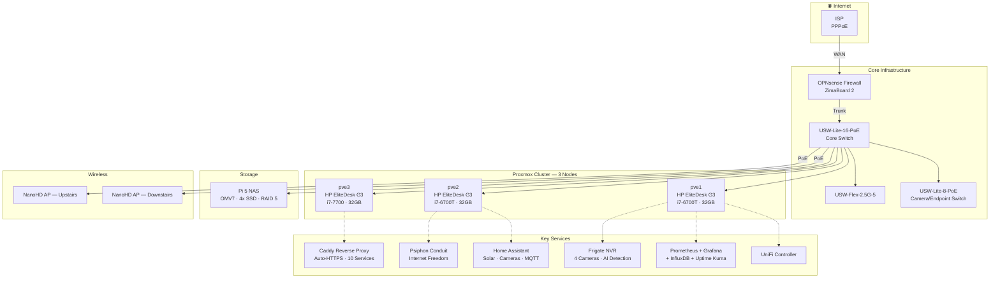

# 🏠 GoozLab — Privacy-First Homelab

> A self-hosted homelab built on open-source software, inspired by [Louis Rossmann's "Introduction to a Self-Managed Life"](https://wiki.futo.org/index.php/Introduction_to_a_Self_Managed_Life:_a_13_hour_%26_28_minute_presentation_by_FUTO_software) guide. Replacing cloud dependencies with local-first infrastructure — and contributing to internet freedom along the way.

---

## What Is This?

GoozLab is a comprehensive home network and security lab that I'm building to learn enterprise networking concepts while following the principles laid out in the [FUTO guide by Louis Rossmann](https://wiki.futo.org/index.php/Introduction_to_a_Self_Managed_Life:_a_13_hour_%26_28_minute_presentation_by_FUTO_software): own your data, control your infrastructure, and reduce dependence on cloud services. Credit where it's due — Louis's 13.5-hour presentation is what kicked this whole project off.

This repo documents the architecture, setup guides, configuration patterns, and — most importantly — the **[lessons I learned the hard way](docs/lessons-learned/index.md)** along the way.

## Architecture Overview

```mermaid
graph TB
    subgraph INTERNET["🌐 Internet"]
        ISP["ISP<br/>PPPoE"]
    end

    subgraph CORE["Core Infrastructure"]
        FW["OPNsense Firewall<br/>ZimaBoard 2"]
        SW16["USW-Lite-16-PoE<br/>Core Switch"]
        SW8["USW-Lite-8-PoE<br/>Camera/Endpoint Switch"]
        FLEX["USW-Flex-2.5G-5"]
    end

    subgraph COMPUTE["Proxmox Cluster — 3 Nodes"]
        PVE1["pve1<br/>HP EliteDesk G3<br/>i7-6700T · 32GB"]
        PVE2["pve2<br/>HP EliteDesk G3<br/>i7-6700T · 32GB"]
        PVE3["pve3<br/>HP EliteDesk G3<br/>i7-7700 · 32GB"]
    end

    subgraph STORAGE["Storage"]
        NAS["Pi 5 NAS<br/>OMV7 · 4x SSD · RAID 5"]
    end

    subgraph WIRELESS["Wireless"]
        AP1["NanoHD AP — Downstairs"]
        AP2["NanoHD AP — Upstairs"]
    end

    subgraph SERVICES["Key Services"]
        UNIFI["UniFi Controller"]
        MON["Prometheus + Grafana<br/>+ InfluxDB + Uptime Kuma"]
        CONDUIT["Psiphon Conduit<br/>Internet Freedom"]
        FRIGATE["Frigate NVR<br/>4 Cameras · AI Detection"]
        HA["Home Assistant<br/>Solar · Cameras · MQTT"]
        CADDY["Caddy Reverse Proxy<br/>Auto-HTTPS · 10 Services"]
    end

    ISP -->|"WAN"| FW
    FW -->|"Trunk"| SW16
    SW16 --> SW8
    SW16 --> FLEX
    SW16 --> PVE1
    SW16 --> PVE2
    SW16 --> PVE3
    SW16 --> NAS
    SW16 -->|"PoE"| AP1
    SW16 -->|"PoE"| AP2
    PVE1 -.-> UNIFI
    PVE1 -.-> MON
    PVE1 -.-> FRIGATE
    PVE2 -.-> HA
    PVE2 -.-> CONDUIT
    PVE3 -.-> CADDY
```

## Network Segmentation

Six VLANs with a simple naming convention — the VLAN ID matches the third octet of the subnet (VLAN 10 → `10.0.10.0/24`). Makes troubleshooting intuitive: if you see `10.0.30.x` in a log, you instantly know it's IoT.

| VLAN | Name | Purpose |
|------|------|---------|
| 10 | Management | Infrastructure: switches, Proxmox, NAS, controller |
| 20 | Trusted | Personal devices, workstations |
| 30 | IoT | Cameras, smart home devices (restricted) |
| 50 | Guest | Visitor Wi-Fi — internet only, no LAN access |
| 60 | WireGuard | VPN tunnel interface for secure remote access |
| 70 | Conduit | Isolated network for Psiphon proxy traffic |

> **Note:** Specific IP assignments and host mappings are kept out of this public repo intentionally. The subnet design pattern is what matters — the actual addresses are in my private documentation.

## Hardware

| Device | Role | Key Specs |
|--------|------|-----------|
| ZimaBoard 2 (1664) | OPNsense Firewall/Router | Intel N150, 16GB LPDDR5x, Dual 2.5GbE, 64GB eMMC |
| HP EliteDesk 800 G3 (×2) | Proxmox Nodes 1 & 2 | i7-6700T @ 2.8GHz (4C/8T, 35W), 32GB DDR4 each |
| HP EliteDesk 800 G3 (×1) | Proxmox Node 3 | i7-7700 @ 3.6GHz (4C/8T, 65W), 32GB DDR4 |
| Raspberry Pi 5 (4GB) | NAS — OpenMediaVault 7 | Radxa Penta SATA HAT, 4× Kingston 894GB SSD, RAID 5 |
| USW-Lite-16-PoE | Core Switch | 16-port Gigabit, PoE+ (45W budget), 802.1Q VLANs |
| USW-Lite-8-PoE | Secondary Switch | 8-port Gigabit, PoE+ (52W budget) |
| USW-Flex-2.5G-5 | High-bandwidth Switch | 5-port 2.5GbE |
| UniFi NanoHD (×2) | Wireless Access Points | 802.11ac Wave 2, multi-VLAN SSIDs |
| Reolink RLC-510A (×3) | PoE Surveillance Cameras | 5MP, PoE, RTSP for Frigate integration |
| PoE Doorbell Camera | Front Door | PoE-powered, Frigate integration |

## Psiphon Conduit — Internet Freedom

A key part of this homelab runs **[Psiphon Conduit](https://conduit.psiphon.ca/)** nodes — volunteer proxies that help people in censored countries (primarily Iran) access the open internet. The proxy fleet runs across homelab infrastructure and 5 Hetzner Cloud VPS instances, serving ~1,000 concurrent users.

The Conduit traffic is completely isolated on its own VLAN with firewall rules that block all access to internal networks. See the [full write-up](docs/humanitarian/psiphon-conduit.md).

## 📚 Lessons Learned — The Good Stuff

The most valuable part of this repo. Real mistakes, real troubleshooting, real fixes:

- **[Pi NAS Power Supply Gotcha](docs/lessons-learned/pi-nas-power.md)** — Why the official Pi 5 PSU can't power a Radxa SATA HAT with 4 SSDs
- **[PoE Power Budget Mismatch](docs/lessons-learned/poe-power-budget.md)** — When your switch says PoE+ but your device needs PoE++
- **[The DHCP Collision That Broke Everything](docs/lessons-learned/dhcp-collision.md)** — Three switches, same IP, weeks of mysterious flapping
- **[VLAN Migration Without Downtime](docs/lessons-learned/vlan-migration.md)** — Using a temporary Virtual IP as a bridge during the transition
- **[Parallel Network Approach](docs/lessons-learned/parallel-network.md)** — Running old and new routers side by side during cutover
- **[UniFi Adoption Across Subnets](docs/lessons-learned/unifi-adoption.md)** — When the controller and switches can't find each other
- **[Conduit OOM Kill Loops](docs/lessons-learned/conduit-oom.md)** — When three Hetzner nodes entered an unrecoverable out-of-memory death spiral
- **[Frigate iGPU Conflict](docs/lessons-learned/frigate-igpu.md)** — When VAAPI decode and OpenVINO detection fight over the same GPU

> *"The best time to start self-hosting was years ago. The second best time is now."*
> — Louis Rossmann

## Documentation

Full documentation is hosted at **[sohrabros.github.io/homelab](https://sohrabros.github.io/homelab/)** and covers:

- [Architecture & Network Design](docs/architecture/overview.md)
- [Setup Guides](docs/setup/opnsense.md) (OPNsense, Proxmox, NAS, Switching, Monitoring, Caddy, Frigate, Home Assistant)
- [Security Hardening](docs/security/hardening.md) (Suricata IDS/IPS, CrowdSec, Firewall Rules, DNSBL)
- [Humanitarian Tech](docs/humanitarian/psiphon-conduit.md) (Psiphon Conduit)
- [Lessons Learned](docs/lessons-learned/index.md) (Real mistakes and fixes)

## Project Status

| Phase | Status |
|-------|--------|
| OPNsense firewall + PPPoE | ✅ Complete |
| VLAN segmentation (6 VLANs) | ✅ Complete |
| Proxmox cluster (3 nodes, 32GB each) | ✅ Complete |
| Pi 5 NAS (RAID 5, NFS/SMB) | ✅ Complete |
| UniFi switching + wireless | ✅ Complete |
| Monitoring (Prometheus/Grafana/InfluxDB/Uptime Kuma) | ✅ Complete |
| Homepage dashboard | ✅ Complete |
| WireGuard VPN (multi-peer) | ✅ Complete |
| Suricata IDS/IPS (Hyperscan, LAN/igc0) | ✅ Complete — tuning in Alert mode |
| CrowdSec threat intelligence | ✅ Complete |
| DNS hardening (Quad9 DoT, DNSSEC, DNSBL) | ✅ Complete |
| Caddy reverse proxy (10 services, auto-HTTPS) | ✅ Complete |
| Camera system (Frigate NVR, 4 cameras) | ✅ Complete |
| Home Assistant (Frigate, Solar, MQTT) | ✅ Complete |
| Frigate mobile notifications (HA blueprint) | ✅ Complete |
| Psiphon Conduit fleet (6 nodes, shirokhorshid) | ✅ Operational |
| Tor Snowflake (all Conduit nodes) | ✅ Complete |
| Watchtower auto-updates (all Conduit nodes) | ✅ Complete |
| WireGuard fleet tunnels (metrics via tunnel) | ✅ Complete |
| Freedom Fleet Grafana dashboard | ✅ Complete |
| Ansible fleet management | 📋 Planned |
| Wazuh SOC | 📋 Planned |
| Ollama + Open WebUI (local AI) | 📋 Planned |
| n8n workflow automation | 📋 Planned |
| Immich (photo management) | 📋 Planned |

## License

[MIT](LICENSE) — Use anything here for your own homelab. If the lessons learned save you a headache, that's a win.

---

*Built with frustration, curiosity, and a lot of SSH sessions.*
