# 🏠 GoozLab — Privacy-First Homelab

> A self-hosted homelab built on open-source software, inspired by [Louis Rossmann's "Introduction to a Self-Managed Life"](https://wiki.futo.org/index.php/Introduction_to_a_Self_Managed_Life:_a_13_hour_%26_28_minute_presentation_by_FUTO_software) guide. Replacing cloud dependencies with local-first infrastructure — and contributing to internet freedom along the way.

---

## What Is This?

GoozLab is a comprehensive home network and security lab that I'm building to learn enterprise networking concepts while following the principles laid out in the [FUTO guide by Louis Rossmann](https://wiki.futo.org/index.php/Introduction_to_a_Self_Managed_Life:_a_13_hour_%26_28_minute_presentation_by_FUTO_software): own your data, control your infrastructure, and reduce dependence on cloud services. Credit where it's due — Louis's 13.5-hour presentation is what kicked this whole project off.

This repo documents the architecture, setup guides, configuration patterns, and — most importantly — the **[lessons I learned the hard way](docs/lessons-learned/index.md)** along the way.

## Architecture Overview

```mermaid
graph TB
    subgraph INTERNET["🌐 Internet"]
        ISP["ISP<br/>PPPoE"]
    end

    subgraph CORE["Core Infrastructure"]
        FW["OPNsense Firewall<br/>ZimaBoard 2"]
        SW16["USW-Lite-16-PoE<br/>Core Switch"]
        SW8["USW-Lite-8-PoE<br/>Camera/Endpoint Switch"]
        FLEX["USW-Flex-2.5G-5"]
    end

    subgraph COMPUTE["Proxmox Cluster"]
        PVE1["Proxmox Node 1<br/>HP EliteDesk 800 G3"]
        PVE2["Proxmox Node 2<br/>HP EliteDesk 800 G3"]
    end

    subgraph STORAGE["Storage"]
        NAS["Pi 5 NAS<br/>OMV7 · 4x SSD · RAID 5"]
    end

    subgraph WIRELESS["Wireless"]
        AP1["NanoHD AP — Downstairs"]
        AP2["NanoHD AP — Upstairs"]
    end

    subgraph SERVICES["Key Services"]
        UNIFI["UniFi Controller"]
        MON["Prometheus + Grafana"]
        CONDUIT["Psiphon Conduit<br/>Internet Freedom"]
    end

    ISP -->|"WAN"| FW
    FW -->|"Trunk"| SW16
    SW16 --> SW8
    SW16 --> FLEX
    SW16 --> PVE1
    SW16 --> PVE2
    SW16 --> NAS
    SW16 -->|"PoE"| AP1
    SW16 -->|"PoE"| AP2
    PVE1 -.-> UNIFI
    PVE1 -.-> MON
    PVE2 -.-> CONDUIT
```

## Network Segmentation

Seven VLANs with a simple naming convention — the VLAN ID matches the third octet of the subnet (VLAN 10 → `10.0.10.0/24`). Makes troubleshooting intuitive: if you see `10.0.30.x` in a log, you instantly know it's IoT.

| VLAN | Name | Purpose |
|------|------|---------|
| 10 | Management | Infrastructure: switches, Proxmox, NAS, controller |
| 20 | Trusted | Personal devices, workstations |
| 30 | IoT | Cameras, smart home devices (restricted) |
| 50 | Guest | Visitor Wi-Fi — internet only, no LAN access |
| 60 | WireGuard | VPN tunnel interface for secure remote access |
| 70 | Conduit | Isolated network for Psiphon proxy traffic |

> **Note:** Specific IP assignments and host mappings are kept out of this public repo intentionally. The subnet design pattern is what matters — the actual addresses are in my private documentation.

## Hardware

| Device | Role | Key Specs |
|--------|------|-----------|
| ZimaBoard 2 (1664) | OPNsense Firewall/Router | Intel N150, 16GB LPDDR5x, Dual 2.5GbE, 64GB eMMC |
| HP EliteDesk 800 G3 (×2) | Proxmox Cluster Nodes | i7-6700 @ 3.4GHz (4C/8T), 32GB DDR4 each |
| Raspberry Pi 5 (4GB) | NAS — OpenMediaVault 7 | Radxa Penta SATA HAT, 4× Kingston 894GB SSD, RAID 5 |
| USW-Lite-16-PoE | Core Switch | 16-port Gigabit, PoE+ (45W budget), 802.1Q VLANs |
| USW-Lite-8-PoE | Secondary Switch | 8-port Gigabit, PoE+ (52W budget) |
| USW-Flex-2.5G-5 | High-bandwidth Switch | 5-port 2.5GbE |
| UniFi NanoHD (×2) | Wireless Access Points | 802.11ac Wave 2, multi-VLAN SSIDs |
| Reolink RLC-510A (×3) | PoE Surveillance Cameras | 5MP, PoE, RTSP for Frigate integration |
| PoE Doorbell Camera | Front Door | PoE-powered, Frigate integration |

## Psiphon Conduit — Internet Freedom

A key part of this homelab runs **[Psiphon Conduit](https://conduit.psiphon.ca/)** nodes — volunteer proxies that help people in censored countries (primarily Iran) access the open internet. The proxy fleet runs across homelab infrastructure and Hetzner VPS instances, serving hundreds of concurrent users and transferring terabytes of data.

The Conduit traffic is completely isolated on its own VLAN with firewall rules that block all access to internal networks. See the [full write-up](docs/humanitarian/psiphon-conduit.md).

## 📚 Lessons Learned — The Good Stuff

The most valuable part of this repo. Real mistakes, real troubleshooting, real fixes:

- **[Pi NAS Power Supply Gotcha](docs/lessons-learned/pi-nas-power.md)** — Why the official Pi 5 PSU can't power a Radxa SATA HAT with 4 SSDs
- **[PoE Power Budget Mismatch](docs/lessons-learned/poe-power-budget.md)** — When your switch says PoE+ but your device needs PoE++
- **[The DHCP Collision That Broke Everything](docs/lessons-learned/dhcp-collision.md)** — Three switches, same IP, weeks of mysterious flapping
- **[VLAN Migration Without Downtime](docs/lessons-learned/vlan-migration.md)** — Using a temporary Virtual IP as a bridge during the transition
- **[Parallel Network Approach](docs/lessons-learned/parallel-network.md)** — Running old and new routers side by side during cutover
- **[UniFi Adoption Across Subnets](docs/lessons-learned/unifi-adoption.md)** — When the controller and switches can't find each other

→ [Read all lessons learned](docs/lessons-learned/index.md)

## Guiding Principles

This project follows the philosophy from [Louis Rossmann's FUTO guide](https://wiki.futo.org/index.php/Introduction_to_a_Self_Managed_Life:_a_13_hour_%26_28_minute_presentation_by_FUTO_software):

1. **Own Your Data** — Self-host everything possible. No cloud dependency for core services.
2. **Open Source First** — Every component is open source or has an open-source alternative.
3. **Privacy by Default** — DNS-over-TLS, encrypted tunnels, no telemetry, no ads in the stack.
4. **Learn by Doing** — Build it yourself, break it, fix it, document what you learned.
5. **Give Back** — Use surplus infrastructure to help others (Psiphon Conduit for internet freedom).

> *"The best time to start self-hosting was years ago. The second best time is now."*
> — Louis Rossmann

## Documentation

Full documentation is hosted at **[sohrabros.github.io/homelab](https://sohrabros.github.io/homelab/)** and covers:

- [Architecture & Network Design](docs/architecture/overview.md)
- [Setup Guides](docs/setup/opnsense.md) (OPNsense, Proxmox, NAS, Switching, Monitoring)
- [Security Hardening](docs/security/hardening.md) (Suricata IDS/IPS, CrowdSec, Firewall Rules)
- [Humanitarian Tech](docs/humanitarian/psiphon-conduit.md) (Psiphon Conduit)
- [Lessons Learned](docs/lessons-learned/index.md) (Real mistakes and fixes)

## Project Status

| Phase | Status |
|-------|--------|
| OPNsense firewall + PPPoE | ✅ Complete |
| VLAN segmentation (7 VLANs) | ✅ Complete |
| Proxmox cluster (2 nodes, 32GB each) | ✅ Complete |
| Pi 5 NAS (RAID 5, NFS/SMB) | ✅ Complete |
| UniFi switching + wireless | ✅ Complete |
| Monitoring (Prometheus/Grafana/Uptime Kuma) | ✅ Complete |
| WireGuard VPN | ✅ Complete |
| Suricata IDS + CrowdSec | ✅ Complete |
| Psiphon Conduit fleet | ✅ Operational |
| Camera system (Frigate NVR) | 🔶 Cabling in progress |
| Self-hosted services (Jellyfin, Immich, etc.) | 📋 Planned |
| Home Assistant integration | 📋 Planned |

## License

[MIT](LICENSE) — Use anything here for your own homelab. If the lessons learned save you a headache, that's a win.

---

*Built with frustration, curiosity, and a lot of SSH sessions.*
