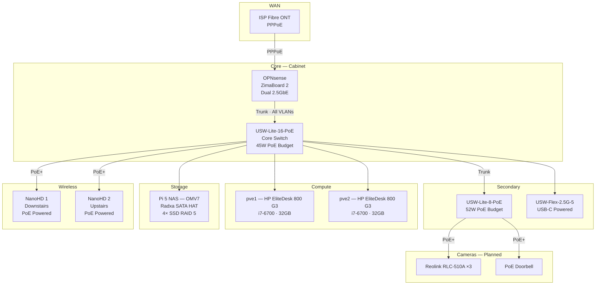

# Network Design

## Physical Topology

## Subnet Design

The VLAN ID matches the third octet of each subnet. This was the single best design decision in the whole project — see [Lessons Learned](../lessons-learned/index.md) for why.

| VLAN | Name | Subnet | Gateway | DHCP Range | Purpose |
|------|------|--------|---------|------------|---------|
| 10 | Management | `10.0.10.0/24` | `.1` | `.200-.250` | Infrastructure only |
| 20 | Trusted | `10.0.20.0/24` | `.1` | `.100-.250` | Personal devices |
| 30 | IoT | `10.0.30.0/24` | `.1` | `.100-.250` | Cameras, smart devices |
| 50 | Guest | `10.0.50.0/24` | `.1` | `.100-.250` | Visitor Wi-Fi |
| 60 | WireGuard | `10.0.60.0/24` | `.1` | — | VPN tunnel interface |
| 70 | Conduit | `10.0.70.0/24` | `.1` | — | Psiphon proxy (isolated) |

> **IP assignments:** Specific host IPs are not published in this repo. All infrastructure devices use DHCP reservations keyed by MAC address, managed centrally in OPNsense.

## DNS

**Unbound** on OPNsense acts as the recursive DNS resolver for all VLANs:

- **Upstream:** DNS-over-TLS to Quad9 (encrypted, no-logging)
- **DNSSEC:** Enabled — validates DNS responses cryptographically
- **Local zone:** `goozlab.net` with host overrides for all internal services
- **Blocklists:** OISD and Hagezi lists for network-wide ad/tracker blocking
- **DNS redirect rules:** Force all clients to use the local resolver (prevents devices using hardcoded DNS like `8.8.8.8`)

## Switching Infrastructure

### USW-Lite-16-PoE — Core Switch

The backbone of the network. All infrastructure connects here:

- **Uplink to OPNsense:** Trunk port carrying all VLANs tagged, native VLAN for management
- **Proxmox nodes:** Trunk ports with native Management VLAN, all service VLANs tagged
- **NAS:** Access port on Management VLAN
- **Access points:** PoE+ ports with trunk profiles (all WiFi VLANs tagged)
- **Downlink to secondary switch:** Trunk port

**PoE budget consideration:** The 16-port has a 45W total PoE budget. Two NanoHDs draw ~21W combined, leaving ~24W. Plan carefully if adding PoE cameras here — the 8-port switch (52W budget) is better suited for camera duty.

### USW-Lite-8-PoE — Camera/Endpoint Switch

Dedicated to PoE cameras and endpoints that don't need trunk ports. 52W PoE budget is better suited for camera loads.

### USW-Flex-2.5G-5

Originally PoE-powered from the 8-port switch, but this caused [intermittent connectivity issues](../lessons-learned/poe-power-budget.md) because the Flex needs 802.3bt PoE++ and the 8-port only provides 802.3at PoE+. Now powered via USB-C.

Used for high-bandwidth connections where 2.5GbE matters (connecting to the ZimaBoard 2's 2.5GbE ports, for example).

## Wireless

### Two UniFi NanoHD Access Points

Both APs are adopted into a single UniFi controller (running as an LXC container on Proxmox). They broadcast the same SSIDs and handle roaming automatically.

**SSID-to-VLAN mapping:**

| SSID | VLAN | Purpose |
|------|------|---------|
| `GoozLab` | 20 (Trusted) | Personal devices |
| `GoozLab-IoT` | 30 (IoT) | Smart home, cameras on WiFi |
| `GoozLab-Guest` | 50 (Guest) | Visitors — internet only |

All SSIDs use WPA2. The AP trunk ports carry all three VLANs tagged.

## Remote Access

**WireGuard VPN** on OPNsense with Cloudflare DDNS for the public endpoint. No services are exposed to the internet — everything is accessed through the tunnel.

The VPN lands on VLAN 60 with firewall rules allowing access to the Management VLAN. This means remote access has the same visibility as being physically on the management network.
