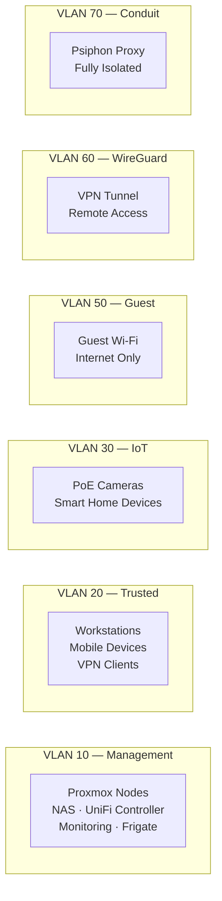

# VLAN Segmentation

## Why Segment?

A flat home network puts every device on the same broadcast domain. Your work laptop, your kids' tablets, your IoT cameras, and a guest's phone all share the same network. If any one device is compromised, the attacker can reach everything.

VLANs solve this by creating separate network segments that can only communicate through firewall rules. A compromised IoT camera can't scan your trusted devices because the firewall blocks inter-VLAN traffic by default.

## The Seven VLANs

### VLAN 10 — Management

The crown jewels. Only infrastructure devices live here: Proxmox nodes, the NAS, UniFi controller, monitoring stack, and Frigate NVR. No user devices. Access is restricted to the Trusted and WireGuard VLANs via firewall rules.

### VLAN 20 — Trusted

Personal devices that need full network access: workstations, laptops, phones. Can reach the Management VLAN (for admin tasks) and the internet. This is where you land when connecting to the primary WiFi SSID.

### VLAN 30 — IoT

Cameras, smart plugs, smart speakers, anything with questionable firmware. **Heavily restricted:** can reach the internet (for cloud-dependent devices) and the local DNS resolver, but cannot reach any other VLAN. See [Firewall Rules](../security/firewall-rules.md) for the specific deny rules.

### VLAN 50 — Guest

Visitor WiFi. Internet access only — no access to any internal network. Separate DHCP scope, separate DNS, completely isolated.

### VLAN 60 — WireGuard

The VPN tunnel interface. Remote clients land here and firewall rules grant them access to the Management VLAN, effectively giving them the same access as being on the Trusted network.

### VLAN 70 — Conduit

**Completely isolated.** The Psiphon Conduit proxy runs here. Firewall rules explicitly block all traffic to any internal VLAN — the only permitted traffic is outbound to the internet. Even if someone exploited the Conduit service, they could not reach any internal infrastructure.

## Inter-VLAN Traffic Matrix

| Source → | Management | Trusted | IoT | Guest | WireGuard | Conduit |
|----------|:---:|:---:|:---:|:---:|:---:|:---:|
| **Management** | ✅ | ✅ | ✅ | ❌ | ✅ | ❌ |
| **Trusted** | ✅ | ✅ | ✅ | ❌ | ✅ | ❌ |
| **IoT** | ❌ | ❌ | ✅ | ❌ | ❌ | ❌ |
| **Guest** | ❌ | ❌ | ❌ | ✅ | ❌ | ❌ |
| **WireGuard** | ✅ | ✅ | ✅ | ❌ | ✅ | ❌ |
| **Conduit** | ❌ | ❌ | ❌ | ❌ | ❌ | ✅ |

✅ = Allowed &nbsp; ❌ = Blocked by firewall

## Design Decision: VLAN ID = Third Octet

Making VLAN 10 map to `10.0.10.0/24`, VLAN 20 to `10.0.20.0/24`, etc. was deliberate. When you see an IP address in a firewall log, you immediately know which segment it belongs to without looking anything up. It also makes subnet calculations trivial and reduces configuration errors.
