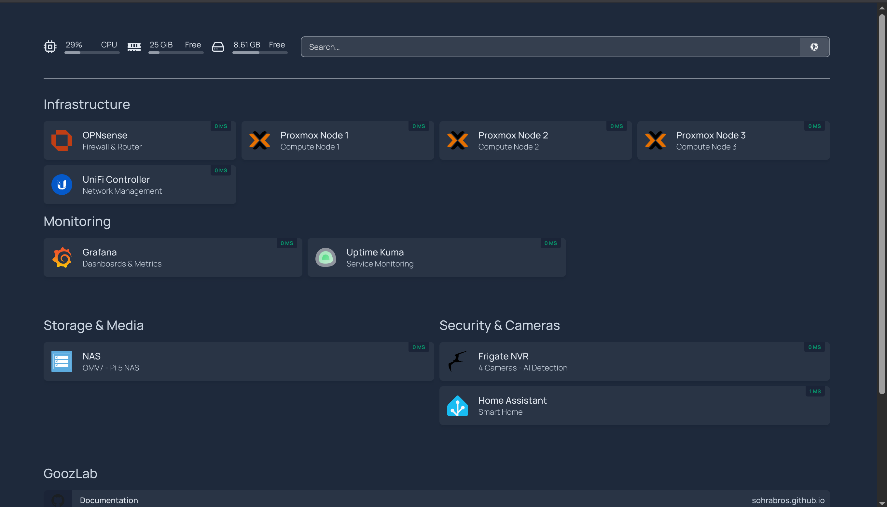

# GoozLab — Privacy-First Home Infrastructure

*Self-hosted homelab built on open-source software and [FUTO principles](https://wiki.futo.org/index.php/Introduction_to_a_Self_Managed_Life:_a_13_hour_%26_28_minute_presentation_by_FUTO_software).
Replacing cloud dependencies with local-first infrastructure while contributing to global internet freedom.*



---

## What's Inside

<div class="grid cards" markdown>

-   **:material-shield-lock: OPNsense Firewall**

    ---

    Stateful firewall with 6-VLAN segmentation, Suricata IDS/IPS (Hyperscan), CrowdSec, WireGuard VPN, and Quad9 DNS-over-TLS — running on a ZimaBoard 2.

    [:octicons-arrow-right-24: Setup Guide](setup/opnsense.md)

-   **:material-server-network: Proxmox Cluster**

    ---

    Three-node cluster on HP EliteDesk 800 G3 Minis with 32GB RAM each, running all services as LXC containers and VMs with full quorum.

    [:octicons-arrow-right-24: Setup Guide](setup/proxmox.md)

-   **:material-harddisk: RAID 5 NAS**

    ---

    Raspberry Pi 5 with Radxa SATA HAT, 4× Kingston 894GB SSDs in RAID 5 under OpenMediaVault 7. NFS/SMB shared to the Proxmox cluster.

    [:octicons-arrow-right-24: Setup Guide](setup/nas.md)

-   **:material-earth: Internet Freedom**

    ---

    Psiphon Conduit freedom fleet — 6 nodes running the shirokhorshid compartment with Tor Snowflake, serving users in censored regions via WireGuard-secured monitoring.

    [:octicons-arrow-right-24: Learn More](humanitarian/psiphon-conduit.md)

-   **:material-chart-line: Full Observability**

    ---

    Prometheus (30 targets), Grafana dashboards, custom exporters (Frigate, SNMP, Blackbox), Uptime Kuma, and a Homepage dashboard for complete infrastructure visibility.

    [:octicons-arrow-right-24: Monitoring Stack](setup/monitoring.md)

-   **:material-cctv: Frigate NVR**

    ---

    AI-powered camera system with 4 PoE cameras, Intel iGPU OpenVINO detection, tiered retention, semantic search, face recognition, LPR, and mobile push notifications via Home Assistant.

    [:octicons-arrow-right-24: Setup Guide](setup/frigate.md)

-   **:material-home-assistant: Home Assistant**

    ---

    Smart home hub integrating Frigate cameras, FoxESS solar monitoring, Tigo optimizers, MQTT, household mobile notifications, and Prometheus metrics export.

    [:octicons-arrow-right-24: Setup Guide](setup/home-assistant.md)

-   **:material-lock: Caddy Reverse Proxy**

    ---

    Auto-HTTPS via Let's Encrypt with Cloudflare DNS-01 challenge. Services behind TLS at goozlab.net with HTTPS upstream for self-signed backends.

    [:octicons-arrow-right-24: Setup Guide](setup/caddy.md)

-   **:material-shield-alert: Wazuh SOC**

    ---

    Centralized security operations with Wazuh 4.14.4 — 7 agents monitoring every node, vulnerability scanning, MITRE ATT&CK mapping, Suricata IDS correlation, and automated active response pushing firewall blocks to OPNsense.

    [:octicons-arrow-right-24: Setup Guide](setup/wazuh.md)

</div>

---

## Infrastructure at a Glance

| Component | Hardware / Platform | Role |
|---|---|---|
| OPNsense | ZimaBoard 2 (N150, 16GB) | Firewall, VPN, DNS, IDS/IPS, CrowdSec |
| pve1 | HP EliteDesk G3 (i7-6700T, 32GB) | Proxmox compute node — Frigate NVR |
| pve2 | HP EliteDesk G3 (i7-6700T, 32GB) | Proxmox compute node — Home Assistant |
| pve3 | HP EliteDesk G3 (i7-7700, 32GB) | Proxmox compute node — Conduit homelab |
| NAS | Raspberry Pi 5 (4GB) + Radxa SATA HAT | OMV7, RAID 5, NFS/SMB |
| Switches | USW-Lite-16-PoE, USW-Lite-8-PoE, Flex Mini 2.5G | VLAN-aware switching, SNMP monitored |
| Wireless | 2× UniFi NanoHD | Dual-band WiFi, SNMP monitored |
| Cameras | 3× Reolink RLC-510A + 1× PoE Doorbell | Frigate NVR with AI detection |
| Wazuh SOC | VM 200 on pve2 (4 cores, 8GB RAM) | SIEM/XDR — 7 agents, vuln scanning, active response |
| Conduit Fleet | 5× Hetzner CX23 (Helsinki) | Internet freedom proxy nodes |

---

## Project Status

| Phase | Status |
|---|---|
| OPNsense firewall + PPPoE | :material-check-circle:{ .green } Complete |
| VLAN segmentation (6 VLANs) | :material-check-circle:{ .green } Complete |
| Proxmox cluster (3 nodes, 32GB each) | :material-check-circle:{ .green } Complete |
| Pi 5 NAS (RAID 5, NFS/SMB) | :material-check-circle:{ .green } Complete |
| UniFi switching + wireless | :material-check-circle:{ .green } Complete |
| Core monitoring (Prometheus/Grafana/Uptime Kuma) | :material-check-circle:{ .green } Complete |
| Expanded monitoring (Frigate/SNMP/Blackbox exporters) | :material-check-circle:{ .green } Complete |
| Homepage dashboard | :material-check-circle:{ .green } Complete |
| WireGuard VPN (multi-peer, household) | :material-check-circle:{ .green } Complete |
| Suricata IDS/IPS (Hyperscan, LAN/igc0) | :material-check-circle:{ .green } Complete — tuning in Alert mode |
| CrowdSec threat intelligence | :material-check-circle:{ .green } Complete |
| DNS hardening (Quad9 DoT, DNSSEC, DNSBL) | :material-check-circle:{ .green } Complete |
| Caddy reverse proxy (auto-HTTPS, DNS-01) | :material-check-circle:{ .green } Complete |
| Camera system (Frigate NVR, 4 cameras, AI detection) | :material-check-circle:{ .green } Complete |
| Home Assistant (Frigate, Solar, MQTT, notifications) | :material-check-circle:{ .green } Complete |
| Psiphon Conduit fleet (6 nodes, shirokhorshid) | :material-check-circle:{ .green } Operational |
| Tor Snowflake (all Conduit nodes) | :material-check-circle:{ .green } Complete |
| Watchtower auto-updates (all Conduit nodes) | :material-check-circle:{ .green } Complete |
| WireGuard fleet tunnels (metrics via tunnel) | :material-check-circle:{ .green } Complete |
| Freedom Fleet Grafana dashboard | :material-check-circle:{ .green } Complete |
| Ansible fleet management | :material-clipboard-text-outline: Planned |
| Conduit Fleet Intelligence Dashboard (humanitarian metrics) | :material-clipboard-text-outline: Planned |
| Suricata: Alert → Drop mode | :material-clipboard-text-outline: Planned |
| Wazuh SOC (7 agents, MITRE ATT&CK, active response) | :material-check-circle:{ .green } Complete |
| Ollama + Open WebUI (local AI) | :material-clipboard-text-outline: Planned — Phase 3 |
| n8n workflow automation | :material-clipboard-text-outline: Planned — Phase 4 |
| Immich (photo management) | :material-clipboard-text-outline: Planned |
| Syncthing (phone backup) | :material-clipboard-text-outline: Planned |

---

## Network Design

```
Internet ──► OPNsense (ZimaBoard 2)
              │
              ├── VLAN 10: Management    (10.0.10.x) — Proxmox, NAS, UniFi, Monitoring
              ├── VLAN 20: Trusted       (10.0.20.x) — Workstations, laptops
              ├── VLAN 30: IoT           (10.0.30.x) — Cameras, smart devices
              ├── VLAN 50: Guest         (10.0.50.x) — Isolated guest WiFi
              ├── VLAN 60: WireGuard     (10.0.60.x) — VPN peers + Hetzner fleet tunnels
              └── VLAN 70: Conduit       (10.0.70.x) — Humanitarian proxy (fully isolated)
```

---

## Key Principles

- **FUTO-aligned:** Local control, no cloud dependency, open-source software
- **Defense in depth:** VLAN isolation, Suricata IDS/IPS, CrowdSec, DNSBL, WireGuard encryption
- **Humanitarian purpose:** Dedicated proxy fleet serving users in censored regions
- **Documentation-first:** Every build, every mistake, every lesson — documented publicly

---

[View on GitHub](https://github.com/sohrabros/homelab) ·
[Get Started](setup/opnsense.md) ·
[Internet Freedom](humanitarian/psiphon-conduit.md)
