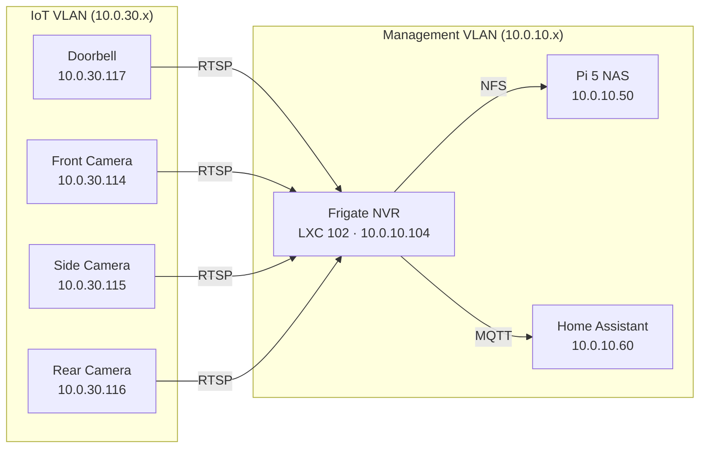

# Frigate NVR

Frigate is a self-hosted NVR running inside a Docker container on a privileged Proxmox LXC, providing real-time AI object detection, recording, and snapshot capture for all four PoE cameras — completely local with no cloud dependencies.

## Architecture



## Hardware

**Cameras:**

| Location | Model | IP | MAC |
|----------|-------|----|-----|
| Doorbell | Reolink PoE Doorbell | `10.0.30.117` | `ec:71:db:d2:8f:aa` |
| Front | Reolink RLC-510A (5MP) | `10.0.30.114` | `ec:71:db:bf:49:a6` |
| Side | Reolink RLC-510A (5MP) | `10.0.30.115` | `ec:71:db:eb:53:2a` |
| Rear | Reolink RLC-510A (5MP) | `10.0.30.116` | `ec:71:db:3f:12:53` |

All cameras are powered via PoE from the USW-Lite-8-PoE switch with ports assigned to the IoT VLAN profile.

**Compute:** Frigate runs as LXC container 102 on pve1 (HP EliteDesk 800 G3 Mini, i7-6700T). The Intel HD 530 iGPU provides both VAAPI hardware video decoding and OpenVINO AI object detection.

## LXC Container

The Frigate container runs as a privileged LXC to allow GPU device passthrough and future Coral TPU support.

| Setting | Value |
|---------|-------|
| CT ID | 102 |
| Node | pve1 |
| IP | `10.0.10.104/24` |
| Gateway | `10.0.10.1` |
| RAM | 4096 MB |
| CPU | 2 cores |
| Disk | 16 GB (local-lvm) |
| Type | Privileged (unprivileged=0) |
| Features | nesting=1 |

### Intel iGPU Passthrough

The Intel HD 530 iGPU is passed through to the LXC for hardware-accelerated video decoding (VAAPI) and AI inference (OpenVINO). This is configured in the container's Proxmox config file.

**On pve1 host — edit `/etc/pve/lxc/102.conf`:**

```
lxc.cgroup2.devices.allow: c 226:* rwm
lxc.mount.entry: /dev/dri dev/dri none bind,optional,create=dir
```

After adding these lines, restart the container. Frigate auto-detects the GPU and enables VAAPI decoding.

## Storage

Recordings and snapshots are stored on the Pi 5 NAS (10.0.10.50) via NFS.

**NAS side (OMV7):**

1. Create shared folder `frigate-recordings` on the RAID 5 array
2. Enable NFS share for `10.0.10.0/24` with `rw,no_root_squash` permissions

**Proxmox host side — mount and bind into LXC:**

```bash
# /etc/fstab on pve1
10.0.10.50:/export/frigate-recordings /mnt/nas-frigate nfs defaults 0 0
```

```bash
# /etc/pve/lxc/102.conf
mp0: /mnt/nas-frigate,mp=/mnt/nas-frigate
```

**Inside the container**, the NFS mount appears at `/mnt/nas-frigate` and is mapped to `/media/frigate` in the Docker container via the compose file.

## Docker Compose

```yaml
version: "3.9"
services:
  frigate:
    container_name: frigate
    privileged: true
    restart: unless-stopped
    image: ghcr.io/blakeblackshear/frigate:stable
    shm_size: "640mb"
    volumes:
      - /etc/localtime:/etc/localtime:ro
      - ./config:/config
      - /mnt/nas-frigate:/media/frigate
      - type: tmpfs
        target: /tmp/cache
        tmpfs:
          size: 1000000000
    ports:
      - "5000:5000"
      - "8554:8554"
      - "8555:8555/tcp"
      - "8555:8555/udp"
    devices:
      - /dev/dri:/dev/dri
```

!!! warning "SHM Size"
    With 4 cameras (8 streams total — main + sub per camera), the default 64MB SHM is far too small. Frigate recommends at least 634MB. Set `shm_size: "640mb"` or higher. Insufficient SHM causes frame drops, decoder crashes, and intermittent black screens.

## Frigate Configuration

The full `config/config.yml` with all four cameras, OpenVINO detection, and dual-stream recording:

```yaml
mqtt:
  enabled: true
  host: 10.0.10.60
  port: 1883
  user: mqtt
  password: "<your-mqtt-password>"

go2rtc:
  streams:
    doorbell:
      - rtsp://admin:<password-url-encoded>@10.0.30.117:554/h264Preview_01_main
    doorbell_sub:
      - rtsp://admin:<password-url-encoded>@10.0.30.117:554/h264Preview_01_sub
    front_camera:
      - rtsp://admin:<password-url-encoded>@10.0.30.114:554/h264Preview_01_main
    front_camera_sub:
      - rtsp://admin:<password-url-encoded>@10.0.30.114:554/h264Preview_01_sub
    side_camera:
      - rtsp://admin:<password-url-encoded>@10.0.30.115:554/h264Preview_01_main
    side_camera_sub:
      - rtsp://admin:<password-url-encoded>@10.0.30.115:554/h264Preview_01_sub
    rear_camera:
      - rtsp://admin:<password-url-encoded>@10.0.30.116:554/h264Preview_01_main
    rear_camera_sub:
      - rtsp://admin:<password-url-encoded>@10.0.30.116:554/h264Preview_01_sub

detectors:
  ov:
    type: openvino
    device: GPU
    model_path: /openvino-model/ssdlite_mobilenet_v2.xml

model:
  width: 300
  height: 300
  input_tensor: nhwc
  input_pixel_format: bgr
  labelmap_path: /openvino-model/coco_91cl_bkgr.txt

detect:
  enabled: true

cameras:
  doorbell:
    ffmpeg:
      inputs:
        - path: rtsp://127.0.0.1:8554/doorbell
          roles:
            - detect
        - path: rtsp://127.0.0.1:8554/doorbell_sub
          roles:
            - record
    detect:
      width: 2560
      height: 1920
      fps: 5
    record:
      enabled: true
      retain:
        days: 14
        mode: motion
    snapshots:
      enabled: true
      retain:
        default: 14
    objects:
      track:
        - person
        - car
        - dog
        - cat

  front_camera:
    ffmpeg:
      inputs:
        - path: rtsp://127.0.0.1:8554/front_camera
          roles:
            - detect
        - path: rtsp://127.0.0.1:8554/front_camera_sub
          roles:
            - record
    detect:
      width: 2560
      height: 1920
      fps: 5
    record:
      enabled: true
      retain:
        days: 14
        mode: motion
    snapshots:
      enabled: true
      retain:
        default: 14
    objects:
      track:
        - person
        - car
        - dog
        - cat

  side_camera:
    ffmpeg:
      inputs:
        - path: rtsp://127.0.0.1:8554/side_camera
          roles:
            - detect
        - path: rtsp://127.0.0.1:8554/side_camera_sub
          roles:
            - record
    detect:
      width: 2560
      height: 1920
      fps: 5
    record:
      enabled: true
      retain:
        days: 14
        mode: motion
    snapshots:
      enabled: true
      retain:
        default: 14
    objects:
      track:
        - person
        - car
        - dog
        - cat

  rear_camera:
    ffmpeg:
      inputs:
        - path: rtsp://127.0.0.1:8554/rear_camera
          roles:
            - detect
        - path: rtsp://127.0.0.1:8554/rear_camera_sub
          roles:
            - record
    detect:
      width: 2560
      height: 1920
      fps: 5
    record:
      enabled: true
      retain:
        days: 14
        mode: motion
    snapshots:
      enabled: true
      retain:
        default: 14
    objects:
      track:
        - person
        - car
        - dog
        - cat

version: 0.16-0
semantic_search:
  enabled: true
  model_size: small
face_recognition:
  enabled: true
  model_size: small
lpr:
  enabled: true
classification:
  bird:
    enabled: false
```

### Stream Architecture

Each camera uses a dual-stream approach to balance detection quality with storage efficiency:

- **Main stream** (`h264Preview_01_main` at 2560×1920) → used for AI detection, giving maximum resolution for identifying objects
- **Sub stream** (`h264Preview_01_sub` at lower resolution) → used for continuous recording, reducing storage consumption by 60–70%

All streams pass through go2rtc for restreaming, which provides stable WebRTC playback in the UI and prevents multiple direct connections to the cameras.

### AI Features

Frigate 0.16 includes several AI capabilities enabled in this deployment:

- **Semantic search** — natural language search across recorded events
- **Face recognition** — identifies known faces from snapshots
- **LPR (License Plate Recognition)** — reads number plates from detected vehicles
- **Object tracking** — person, car, dog, and cat detection on all cameras

## Detection Performance

The Intel HD 530 iGPU running OpenVINO provides significant performance improvements over CPU-based detection:

| Metric | CPU Detector | OpenVINO (GPU) |
|--------|-------------|----------------|
| Inference speed | 482 ms | **8.98 ms** |
| Detector CPU usage | 174.7% | **14.0%** |
| Improvement | — | **53× faster** |

This performance headroom comfortably supports all 4 cameras simultaneously with room to spare.

## Firewall Rules

Frigate needs cross-VLAN access to reach the cameras on the IoT VLAN.

**OPNsense → Firewall → Rules → MGMT interface:**

| Action | Protocol | Source | Destination | Description |
|--------|----------|--------|-------------|-------------|
| Pass | TCP/UDP | `10.0.10.104` | `10.0.30.0/24` | Allow Frigate to access cameras |

## Network Cabling

All four cameras are wired with outdoor-rated Cat6 cable to the USW-Lite-8-PoE switch. Cable runs were planned using floor plan measurements:

| Camera | Approximate Run |
|--------|----------------|
| Doorbell (front door) | ~12m |
| Front (front of property) | ~15m |
| Side (side passage) | ~20m |
| Rear (back garden) | ~30m |

Total cable used: approximately 77 metres of outdoor-rated Cat6.

## Adding New Cameras

To add a camera to the system:

1. Connect the camera to a PoE port on the switch with IoT VLAN profile
2. Create a static DHCP reservation in OPNsense (Services → DHCPv4 → IoT)
3. Set admin credentials on the camera via its web UI
4. Add the RTSP stream URLs to `go2rtc.streams` in the Frigate config
5. Add the camera definition to the `cameras` section
6. Restart Frigate: `docker compose restart frigate`

## Storage Considerations

At full 5MP main stream recording, each camera generates approximately 1.78 GiB/hour. With 4 cameras and `mode: motion` retention, real-world usage is typically 30–50% of theoretical maximum.

**Estimated storage usage with dual-stream recording:**

| Scenario | Daily (est.) | 14-day retention |
|----------|-------------|-----------------|
| 4 cameras, sub-stream, motion-only | ~25–40 GiB | ~350–560 GiB |
| 4 cameras, main stream, motion-only | ~50–85 GiB | ~700–1200 GiB |

The NAS has 2.58 TiB usable, providing comfortable headroom with the sub-stream recording approach.

## Lessons Learned

**URL-encode special characters in passwords.** The `#` character is interpreted as a URL fragment delimiter in RTSP URLs, silently truncating the password. Use `%23` instead of `#`. This caused extended debugging when the doorbell initially failed to connect.

**SHM size must scale with camera count.** The default 256MB is adequate for 1–2 cameras but causes crashes with 4. Frigate logs the recommended minimum — watch for the warning on startup.

**VAAPI has hardware decode slot limits.** The Intel HD 530 can handle approximately 6–7 simultaneous hardware decode sessions. With 8 streams (4 main + 4 sub), some streams may need to fall back to software decode. If you see "Failed to sync surface" errors, disable `hwaccel_args` on one or two cameras to reduce GPU pressure.

**VLAN double-tagging.** If the Proxmox host bridge already carries the management VLAN as untagged traffic, do not add a VLAN tag to the LXC network interface. Double-tagging prevents the container from getting an IP address.

**go2rtc restreaming is essential.** Connecting Frigate directly to camera RTSP streams causes multiple concurrent connections to each camera, leading to instability. Routing everything through go2rtc ensures a single connection per camera with stable restreaming to all consumers.
