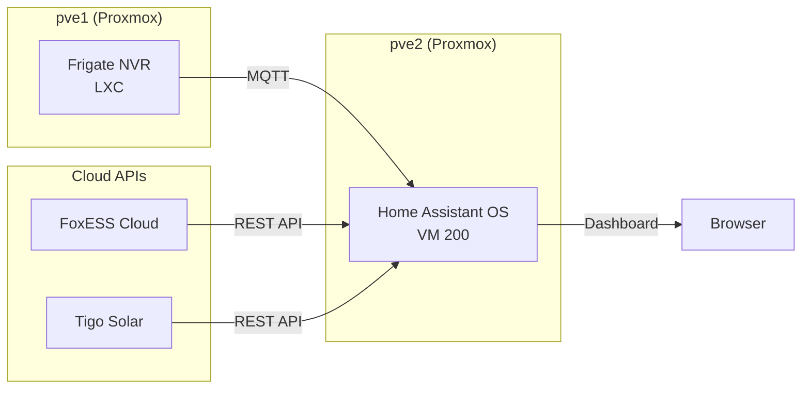

# Home Assistant

Home Assistant OS runs as a virtual machine on pve2, providing a unified dashboard for security cameras, solar monitoring, and home automation — all self-hosted with no cloud dependencies.

## Architecture



## VM Deployment

Home Assistant OS is deployed using the community Proxmox helper script, which automates the VM creation with optimal settings.

**VM Specifications:**

| Setting | Value |
|---------|-------|
| VM ID | 200 |
| IP | `<HOMEASSISTANT-IP>` (DHCP reservation) |
| VLAN | Management (10) |
| RAM | 4 GB |
| CPU | 2 cores (host passthrough) |
| Disk | 32 GB (write-back cache) |
| Machine | q35 |
| OS | Home Assistant OS 17.0 |

**Installation:**

```bash
bash -c "$(wget -qLO - https://github.com/community-scripts/ProxmoxVE/raw/main/vm/haos-vm.sh)"
```

Accept defaults during the wizard. The script creates a q35 VM with EFI boot and optimal settings for HAOS.

!!! warning "VLAN Tagging"
    If your Proxmox host is already on the target VLAN as an untagged/native VLAN, do **not** add a VLAN tag to the VM's network interface. Double-tagging will prevent the VM from getting an IP address. Only add a VLAN tag if the Proxmox bridge carries multiple VLANs as tagged traffic.

After boot, create a DHCP static reservation in OPNsense for the VM's MAC address to ensure a consistent IP.

## Initial Configuration

1. Access the web UI at `http://<HOMEASSISTANT-IP>:8123`
2. Create your admin account
3. Set your home location and timezone
4. Disable analytics (FUTO principle — no telemetry)

## MQTT Broker (Mosquitto)

MQTT connects Frigate NVR to Home Assistant, enabling camera entity discovery and event-driven automations.

**Installation:**

1. Go to **Settings** → **Apps** → search **Mosquitto broker** → Install → Start
2. Create a dedicated MQTT user: **Settings** → **People** → **Users** → **Add User**
    - Set as **local only** and **non-admin**
3. The broker listens on port 1883 (MQTT) and 1884 (WebSocket)

**Adding the MQTT integration:**

After starting Mosquitto, HA auto-discovers it. Go to **Settings** → **Devices & services** → **Integrations** and configure the auto-discovered MQTT entry.

## Frigate Integration

Frigate communicates with Home Assistant over MQTT, automatically registering camera entities.

**Frigate side — update config.yml:**

```yaml
mqtt:
  enabled: true
  host: <HOMEASSISTANT-IP>
  port: 1883
  user: mqtt
  password: "<your-mqtt-password>"
```

!!! danger "YAML and Special Characters"
    If your MQTT password contains `#`, you **must** wrap it in quotes. In YAML, `#` starts a comment — without quotes, everything after `#` is silently discarded. This causes authentication failures that produce no error in Frigate's logs, making it extremely difficult to diagnose.

**Home Assistant side — install via HACS:**

1. Install [HACS](https://hacs.xyz) (Home Assistant Community Store):
    - Install the **Terminal & SSH** app from Settings → Apps
    - Run: `curl -sfSL https://get.hacs.xyz | bash -`
    - Restart HA, then add HACS as an integration and link your GitHub account
2. In HACS, search and download **Frigate Integration**
3. Restart HA
4. Add the integration: **Settings** → **Devices & services** → **Add Integration** → **Frigate**
5. Enter your Frigate URL: `http://<FRIGATE-IP>:5000`

All cameras are auto-discovered and appear as entities (e.g., `camera.doorbell`, `camera.front_camera`).

**Verifying the MQTT connection:**

Frigate does not log MQTT connections. To verify the link is working, check the Mosquitto broker logs in HA under **Settings** → **Apps** → **Mosquitto broker** → **Log** tab. You should see a line like:

```
New client connected from <FRIGATE-IP> as frigate (p2, c1, k60, u'mqtt').
```

You can also test manually:

```bash
mosquitto_pub -h <HOMEASSISTANT-IP> -p 1883 -u mqtt -P "password" -t test -m "hello"
```

## Frigate Lovelace Card

For live camera feeds on the dashboard, install the Frigate Card frontend component.

1. In HACS → **Frontend** tab → search **Frigate Card** → Download
2. Hard refresh your browser: `Ctrl+Shift+R`
3. Create a new dashboard: **Settings** → **Dashboards** → **Add Dashboard**
4. Edit the dashboard → **Start with empty dashboard**

Add individual camera cards (one per camera, not a carousel):

```yaml
type: custom:frigate-card
cameras:
  - camera_entity: camera.doorbell
live:
  preload: true
```

Repeat for each camera entity. This gives a grid layout where all feeds are visible simultaneously.

## Solar Monitoring — FoxESS Cloud

The FoxESS integration pulls data from the FoxCloud API, providing real-time solar generation, battery state of charge, grid import/export, and home consumption data.

**Installation:**

1. In HACS, search and download **Foxess Ha** (by macxq)
2. Restart HA

This integration cannot be added from the UI — it requires manual YAML configuration.

**Get your credentials from FoxCloud:**

1. Log into [foxesscloud.com](https://www.foxesscloud.com)
2. Go to your profile → **API Management** → generate an API key
3. Navigate to your inverter details page — the **deviceID** is the UUID in the URL (between `%22` characters)
4. The **deviceSN** is the serial number shown on the inverter details page

**Add to configuration.yaml:**

```yaml
sensor:
  - platform: foxess
    apiKey: <your-foxess-api-key>
    deviceID: <your-device-uuid>
    deviceSN: <your-inverter-serial>
```

Install the **File editor** app (Settings → Apps) for easy YAML editing. After saving, restart HA.

**Key sensors created:**

| Sensor | Description |
|--------|-------------|
| `sensor.foxess_solar_power` | Current solar generation (kW) |
| `sensor.foxess_bat_soc` | Battery state of charge (%) |
| `sensor.foxess_load_power` | Home consumption (kW) |
| `sensor.foxess_grid_consumption_power` | Grid import (kW) |
| `sensor.foxess_feedin_power` | Grid export (kW) |
| `sensor.foxess_energy_generated` | Today's generation (kWh) |
| `sensor.foxess_energy_generated_month` | Monthly generation (kWh) |
| `sensor.foxess_energy_generated_cumulative` | Lifetime generation (kWh) |

!!! note
    Sensors will show "unknown" at night when the inverter is in standby. Data populates during daylight hours when the panels are producing.

## Solar Monitoring — Tigo

Tigo provides panel-level monitoring through its optimizer hardware, giving per-panel performance data.

**Requirements:** Tigo EI Premium subscription (required for API access).

**Installation:**

1. In HACS → three dots (⋮) → **Custom repositories**
2. Add: `https://github.com/Bobsilvio/tigosolar-online` → Category: **Integration**
3. Search for **Tigo** in HACS → Download
4. Restart HA
5. **Settings** → **Devices & services** → **Add Integration** → **Tigo**
6. Enter your Tigo account credentials

**Key sensors created:**

| Sensor | Description |
|--------|-------------|
| `sensor.tigo_current_power` | Current DC power (W) |
| `sensor.tigo_daily_energy` | Today's generation (kWh) |
| `sensor.tigo_ytd_energy` | Year-to-date generation (kWh) |
| `sensor.tigo_lifetime_energy` | Lifetime generation (kWh) |

## Unified Dashboard

The GoozLab dashboard provides a single-pane-of-glass view combining security cameras, solar monitoring, weather, and system metrics.

**Dashboard layout:**

| Row | Cards |
|-----|-------|
| Top | 4x Frigate camera feeds (individual cards, not carousel) |
| Middle | Solar gauge + Battery gauge |
| Bottom | Energy overview + Generation stats + Tigo panel data + Weather |

**Example cards:**

Solar generation gauge:

```yaml
type: gauge
entity: sensor.foxess_solar_power
name: Solar Generation
unit: kW
min: 0
max: 4
severity:
  green: 2
  yellow: 1
  red: 0
```

Battery state of charge:

```yaml
type: gauge
entity: sensor.foxess_bat_soc
name: Battery
unit: "%"
min: 0
max: 100
severity:
  green: 50
  yellow: 20
  red: 0
```

Energy overview (entities card):

```yaml
type: entities
name: Energy Overview
entities:
  - entity: sensor.foxess_solar_power
    name: Solar Power
  - entity: sensor.foxess_load_power
    name: Home Load
  - entity: sensor.foxess_grid_consumption_power
    name: Grid Import
  - entity: sensor.foxess_feedin_power
    name: Grid Export
  - entity: sensor.foxess_bat_charge_power
    name: Battery Charging
  - entity: sensor.foxess_bat_discharge_power
    name: Battery Discharging
  - entity: sensor.foxess_bat_soc
    name: Battery SoC
```

## Lessons Learned

**YAML comment trap:** The `#` character in YAML starts a comment. If passwords or values contain `#`, they must be quoted. This caused a silent MQTT authentication failure that took significant debugging — Frigate showed no errors, but the password was being truncated at the `#`.

**HAOS is minimal:** The Home Assistant OS VM does not include common tools like `wget`. Use `curl` instead for any command-line downloads.

**Double-tagging breaks networking:** If your Proxmox host bridge already carries the target VLAN as untagged traffic, adding a VLAN tag to the VM's network interface causes double-tagging. The VM will show "No address" until the tag is removed.

**HA 2026.x renames:** Add-ons are now called "Apps" in the 2026.x release. The auto-generated Overview dashboard doesn't support custom cards — create a dedicated dashboard instead.

**Frigate MQTT is silent:** Frigate does not log successful MQTT connections. Always verify from the broker side (Mosquitto logs) rather than expecting Frigate to confirm the connection.
