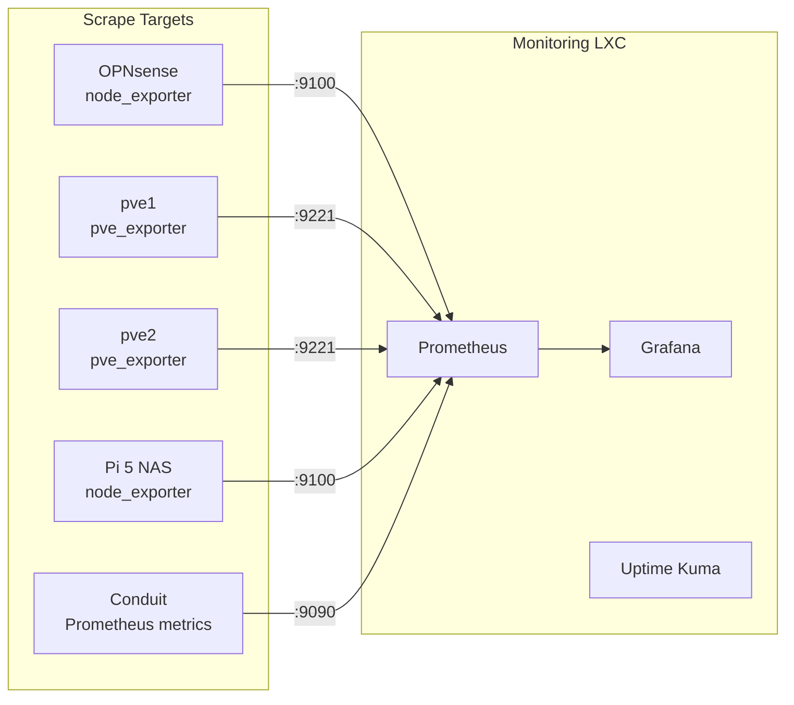

# Monitoring Setup

## Stack

| Tool | Purpose |
|------|---------|
| Prometheus | Metrics collection and storage |
| Grafana | Dashboards and visualisation |
| Uptime Kuma | Service availability monitoring |

All three run in a single Docker Host LXC container on the Management VLAN.

## Architecture



## Deployment

The monitoring stack uses the standard [Docker Host LXC](docker-services.md) pattern:

```yaml
# docker-compose.yml
services:
  prometheus:
    image: prom/prometheus:latest
    container_name: prometheus
    restart: unless-stopped
    volumes:
      - ./prometheus/prometheus.yml:/etc/prometheus/prometheus.yml
      - prometheus_data:/prometheus
    ports:
      - "9090:9090"

  grafana:
    image: grafana/grafana:latest
    container_name: grafana
    restart: unless-stopped
    volumes:
      - grafana_data:/var/lib/grafana
    ports:
      - "3000:3000"

  uptime-kuma:
    image: louislam/uptime-kuma:latest
    container_name: uptime-kuma
    restart: unless-stopped
    volumes:
      - uptime_data:/app/data
    ports:
      - "3001:3001"

volumes:
  prometheus_data:
  grafana_data:
  uptime_data:
```

## Prometheus Configuration

```yaml
# prometheus/prometheus.yml
global:
  scrape_interval: 15s
  evaluation_interval: 15s

scrape_configs:
  - job_name: 'prometheus'
    static_configs:
      - targets: ['localhost:9090']

  - job_name: 'node-exporter'
    static_configs:
      - targets:
        - '<nas-ip>:9100'
        - '<opnsense-ip>:9100'

  - job_name: 'proxmox'
    static_configs:
      - targets:
        - '<pve1-ip>:9221'
        - '<pve2-ip>:9221'

  - job_name: 'conduit'
    static_configs:
      - targets: ['<conduit-ip>:9090']
```

> **Note:** Replace `<*-ip>` placeholders with your actual Management VLAN addresses.

## Grafana Dashboards

Import community dashboards for quick setup:

- **Node Exporter Full** (Dashboard ID: 1860) — CPU, RAM, disk, network for Linux hosts
- **Proxmox VE** (Dashboard ID: 10347) — Cluster and VM/container metrics
- **Custom Conduit dashboard** — Connected clients, data transferred (bytes uploaded/downloaded), connection status

## Uptime Kuma

Monitors service availability with HTTP, TCP, and ping checks. Configure alerts for:

- OPNsense web UI
- Proxmox web UI (both nodes)
- NAS SMB/NFS
- UniFi controller
- Grafana
- Any deployed services

## What To Monitor

At minimum, set up alerts for:

1. **Disk usage >80%** on any host — especially the NAS and Proxmox nodes
2. **RAM usage >90%** — containers will get OOM-killed
3. **Service down** — Uptime Kuma pings for every critical service
4. **RAID degradation** — monitor `mdstat` on the Pi NAS
5. **Conduit client count** — useful to see if the node is serving users
