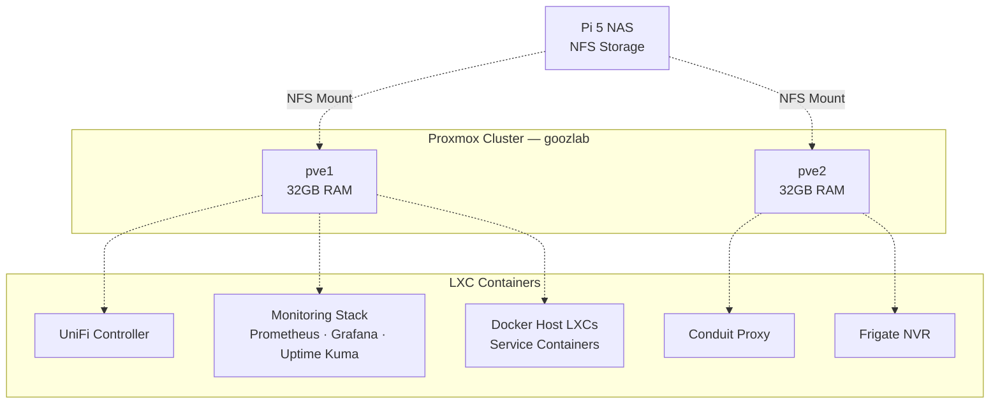

# Proxmox Setup

## Hardware — HP EliteDesk 800 G3 Mini (×2)

| Component | Specification |
|-----------|--------------|
| CPU | Intel i7-6700 @ 3.4GHz (4C/8T, 65W) |
| RAM | 32GB DDR4-2400 (2× 16GB SO-DIMM) |
| Storage | 256GB NVMe SSD (boot + local VM storage) |
| Network | Intel Gigabit Ethernet |
| Power | 90W adapter (65W CPU model — see note below) |

> **Power note:** The i7-6700 is the 65W desktop variant (not the i7-6700T 35W low-power variant). This means you need the 90W HP adapter, not the 65W. If you're considering USB-C PD adapters, ensure they provide 20V at 4.5A+. See the [HP power section](#power-supply-hack) below.

## Cluster Architecture



## Installation

1. Download Proxmox VE ISO from [proxmox.com](https://www.proxmox.com/en/downloads)
2. Flash to USB drive
3. Install on each node's NVMe SSD — use ZFS for the root filesystem
4. Set static IPs on the Management VLAN during install
5. Access web UI at `https://<node-ip>:8006`

## Clustering

On pve1 (the first node), create the cluster:

```bash
pvecm create goozlab
```

On pve2, join:

```bash
pvecm add <pve1-ip>
```

**Important:** With only two nodes, you don't have quorum for automatic failover. Set:

```bash
pvecm expected 1
```

This prevents the cluster from going read-only if one node goes down. Services are manually distributed, not automatically migrated.

## Shared Storage

The Pi 5 NAS exports storage via NFS. Add it in Proxmox:

1. **Datacenter → Storage → Add → NFS**
2. Enter the NAS IP, export path, and select content types (container templates, ISOs, backups)

This gives both nodes access to the same storage pool for templates, ISOs, and backups.

## LXC Container Pattern

All services use the **Docker Host LXC** pattern:

```bash
# Create a privileged LXC with Docker support
pct create <ID> <template> \
  --hostname <service-name> \
  --cores 2 --memory 2048 \
  --rootfs local-zfs:16 \
  --net0 name=eth0,bridge=vmbr0,tag=<VLAN>,ip=dhcp \
  --features nesting=1,keyctl=1 \
  --unprivileged 0
```

Key flags:
- `nesting=1` — Required for Docker to work inside LXC
- `keyctl=1` — Required for some container runtimes
- `tag=<VLAN>` — Places the container on the correct VLAN

See [Docker Services](docker-services.md) for the full deployment pattern.

## Container Inventory

| Service | Node | Cores | RAM | Disk | VLAN |
|---------|------|-------|-----|------|------|
| UniFi Controller | pve1 | 2 | 2GB | 8GB | 10 |
| Monitoring Stack | pve1 | 2 | 4GB | 16GB | 10 |
| Docker Services | pve1 | 2 | 4GB | 16GB | 10 |
| Conduit Proxy | pve2 | 2 | 2GB | 8GB | 70 |
| Frigate NVR | pve2 | 4 | 4GB | 32GB | 10 |

## Power Supply Hack

The HP EliteDesk 800 G3 uses a proprietary 4.5×3.0mm barrel connector with a smart center pin. The original 90W adapter works but is bulky.

**USB-C PD alternative:** A 65W+ GaN USB-C charger with a "USB-C to HP 4.5×3.0mm PD trigger cable" works well. The trigger cable has a chip that requests 20V from the USB-C charger and outputs it to the HP barrel jack. Search for "USB C to 4.5x3.0mm HP barrel jack PD trigger cable."

**Caveat:** The HP may show a "non-genuine adapter" warning — this is cosmetic and safe to ignore. Make sure the charger provides enough wattage for the i7-6700's 65W TDP plus overhead.

## RAM Upgrade Notes

The G3 Mini takes DDR4-2400 SO-DIMMs (laptop RAM), two slots, max 32GB (2× 16GB). DDR4 SO-DIMMs are now end-of-life and prices fluctuate — I paid around £50-60 per 16GB module by watching for deals. Don't overpay.
