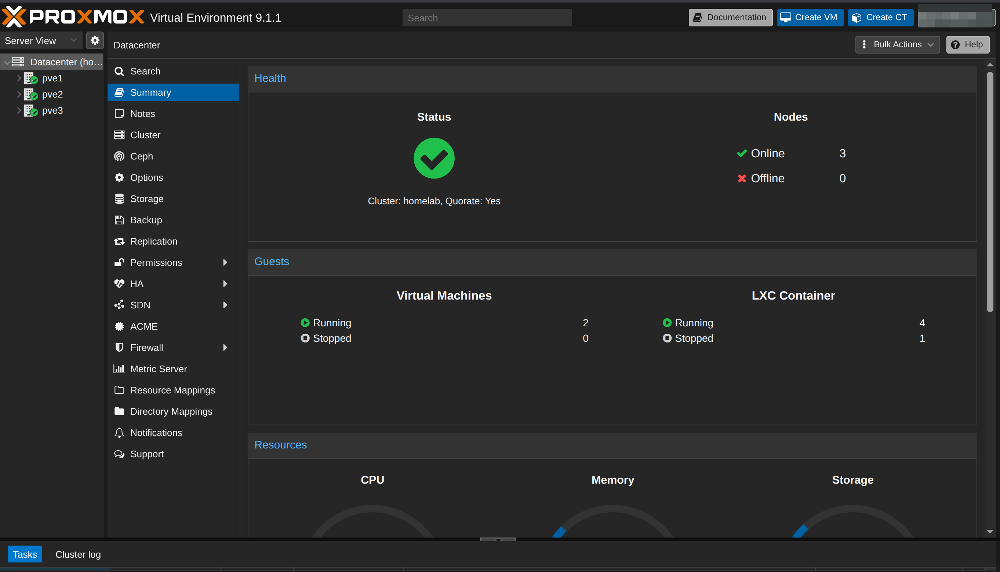
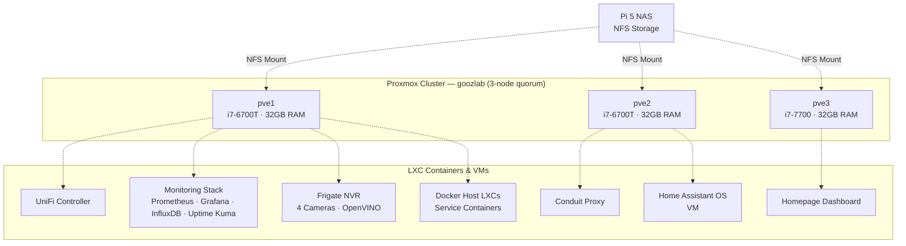

# Proxmox Setup



## Hardware

### Nodes 1 & 2 — HP EliteDesk 800 G3 Mini

| Component | Specification |
|-----------|--------------|
| CPU | Intel i7-6700T @ 2.8GHz (4C/8T, 35W) |
| RAM | 32GB DDR4-2400 (2× 16GB SO-DIMM) |
| Storage | 256GB NVMe SSD (boot + local VM storage) |
| Network | Intel Gigabit Ethernet |
| Power | 65W adapter |

### Node 3 — HP EliteDesk 800 G3 Mini

| Component | Specification |
|-----------|--------------|
| CPU | Intel i7-7700 @ 3.6GHz (4C/8T, 65W) |
| RAM | 32GB DDR4-2400 (2× 16GB SO-DIMM) |
| Storage | Kingston SA400 480GB SATA SSD (ext4/LVM) |
| Network | Intel Gigabit Ethernet |
| Power | 90W adapter (required for 65W TDP CPU) |
| Proxmox | PVE 9.1 |

> **Power note:** The i7-7700 is the 65W desktop variant (not the low-power T model). This requires the 90W HP adapter. If you're considering USB-C PD adapters, ensure they provide 20V at 4.5A+.

## Cluster Architecture


```mermaid
graph TB
    subgraph CLUSTER["Proxmox Cluster — goozlab (3-node quorum)"]
        PVE1["pve1<br/>i7-6700T · 32GB RAM"]
        PVE2["pve2<br/>i7-6700T · 32GB RAM"]
        PVE3["pve3<br/>i7-7700 · 32GB RAM"]
    end

    subgraph LXCs["LXC Containers & VMs"]
        UNIFI["UniFi Controller"]
        MON["Monitoring Stack<br/>Prometheus · Grafana · InfluxDB · Uptime Kuma"]
        DOCKER["Docker Host LXCs<br/>Service Containers"]
        CONDUIT["Conduit Proxy"]
        FRIGATE["Frigate NVR<br/>4 Cameras · OpenVINO"]
        HA["Home Assistant OS<br/>VM"]
        HOMEPAGE["Homepage Dashboard"]
    end

    PVE1 -.-> UNIFI
    PVE1 -.-> MON
    PVE1 -.-> FRIGATE
    PVE1 -.-> DOCKER
    PVE2 -.-> CONDUIT
    PVE2 -.-> HA
    PVE3 -.-> HOMEPAGE

    NAS["Pi 5 NAS<br/>NFS Storage"]
    NAS -.->|"NFS Mount"| PVE1
    NAS -.->|"NFS Mount"| PVE2
    NAS -.->|"NFS Mount"| PVE3
```

## Installation

1. Download Proxmox VE ISO from [proxmox.com](https://www.proxmox.com/en/downloads)
2. Flash to USB drive (or use JetKVM virtual media for remote installs)
3. Install on each node's SSD
4. Set static IPs on the Management VLAN during install
5. Access web UI at `https://<node-ip>:8006`

> **Version matching is critical.** All nodes in the cluster must be on the same major Proxmox version. Check with `pveversion` before adding a new node.

## Clustering

With three nodes, the cluster has proper quorum — no workarounds needed.

On pve1 (the first node), create the cluster:

```bash
pvecm create goozlab
```

On pve2 and pve3, join:

```bash
pvecm add <pve1-ip>
```

Verify quorum:

```bash
pvecm status
```

You should see `Quorate: Yes` and all three nodes listed. With three nodes, the cluster can tolerate one node going down without losing quorum — a significant improvement over the previous two-node setup where `pvecm expected 1` was required as a workaround.

## Shared Storage

The Pi 5 NAS exports storage via NFS. Add it in Proxmox:

1. **Datacenter → Storage → Add → NFS**
2. Enter the NAS IP, export path, and select content types (container templates, ISOs, backups)

This gives all three nodes access to the same storage pool for templates, ISOs, and backups.

> **NFS inside LXC:** NFS mounts inside LXC containers require mounting on the Proxmox host first and using bind mounts to pass through. You cannot mount NFS directly inside an LXC.

## LXC Container Pattern

All services use the **Docker Host LXC** pattern:

```bash
# Create a privileged LXC with Docker support
pct create <ID> <template> \
  --hostname <service-name> \
  --cores 2 --memory 2048 \
  --rootfs local-zfs:16 \
  --net0 name=eth0,bridge=vmbr0,tag=<VLAN>,ip=dhcp \
  --features nesting=1,keyctl=1 \
  --unprivileged 0
```

Key flags:
- `nesting=1` — Required for Docker to work inside LXC
- `keyctl=1` — Required for some container runtimes
- `tag=<VLAN>` — Places the container on the correct VLAN

See [Docker Services](docker-services.md) for the full deployment pattern.

## Container & VM Inventory

| Service | Node | Type | Cores | RAM | Disk | VLAN |
|---------|------|------|-------|-----|------|------|
| UniFi Controller | pve1 | LXC | 2 | 2GB | 8GB | 10 |
| Monitoring Stack | pve1 | LXC | 2 | 4GB | 16GB | 10 |
| Frigate NVR | pve1 | LXC | 2 | 4GB | 32GB | 10 |
| Docker Services | pve1 | LXC | 2 | 4GB | 16GB | 10 |
| Home Assistant | pve2 | VM | 2 | 4GB | 32GB | 10 |
| Conduit Proxy | pve2 | LXC | 2 | 2GB | 8GB | 70 |
| Homepage Dashboard | pve1 | LXC | 1 | 1GB | 8GB | 10 |

## Power Supply Hack

The HP EliteDesk 800 G3 uses a proprietary 4.5×3.0mm barrel connector with a smart center pin. The original adapter works but is bulky.

**USB-C PD alternative:** A 65W+ GaN USB-C charger with a "USB-C to HP 4.5×3.0mm PD trigger cable" works well. The trigger cable has a chip that requests 20V from the USB-C charger and outputs it to the HP barrel jack. Search for "USB C to 4.5x3.0mm HP barrel jack PD trigger cable."

**Caveat:** The HP may show a "non-genuine adapter" warning — this is cosmetic and safe to ignore. Make sure the charger provides enough wattage for your CPU's TDP plus overhead.

## RAM Upgrade Notes

The G3 Mini takes DDR4-2400 SO-DIMMs (laptop RAM), two slots, max 32GB (2× 16GB). DDR4 SO-DIMMs are now end-of-life and prices fluctuate — I paid around £50-60 per 16GB module by watching for deals. Don't overpay.

## JetKVM Note

A JetKVM can be used for remote BIOS access and OS installation via virtual media. However, the virtual media boot feature has a known bug with HP BIOS — USB virtual media may not appear as a bootable device. A physical USB drive is more reliable for HP EliteDesk installs.
